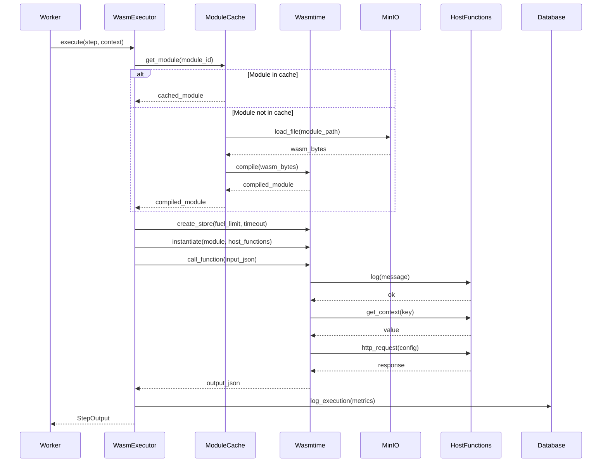

# Design Document

## Overview

This document describes the design for integrating WebAssembly (WASM) runtime capabilities into the Vietnam Enterprise Cron System. The integration adds a new job executor type that enables users to run custom business logic written in multiple programming languages within a secure, sandboxed environment.

### Key Design Principles

1. **Security First**: All WASM modules execute in a sandboxed environment with strict resource limits and permission controls
2. **Performance**: Module caching, AOT compilation, and efficient memory management ensure minimal overhead
3. **Multi-Language Support**: Support for Rust, Go, JavaScript, Python, and C++ through WASM32-WASI compilation target
4. **Seamless Integration**: WASM steps integrate naturally with existing HTTP, database, file, and SFTP job types
5. **Developer Experience**: Rich tooling, templates, and documentation make module development straightforward
6. **Observability**: Comprehensive logging and metrics for all WASM executions
7. **Extensibility**: Plugin architecture allows third-party modules and future enhancements

## Architecture

### High-Level Architecture

```
┌─────────────────────────────────────────────────────────────────┐
│                         Worker Process                           │
│                                                                  │
│  ┌────────────────────────────────────────────────────────┐    │
│  │              Job Execution Engine                       │    │
│  │                                                          │    │
│  │  ┌──────────┐  ┌──────────┐  ┌──────────┐  ┌────────┐ │    │
│  │  │   HTTP   │  │ Database │  │   File   │  │  WASM  │ │    │
│  │  │ Executor │  │ Executor │  │ Executor │  │Executor│ │    │
│  │  └──────────┘  └──────────┘  └──────────┘  └────────┘ │    │
│  │                                                 │        │    │
│  └─────────────────────────────────────────────────┼────────┘    │
│                                                    │             │
│  ┌─────────────────────────────────────────────────▼────────┐    │
│  │            WASM Runtime (Wasmtime)                       │    │
│  │                                                          │    │
│  │  ┌────────────┐  ┌────────────┐  ┌────────────┐       │    │
│  │  │  Module 1  │  │  Module 2  │  │  Module N  │       │    │
│  │  │  (cached)  │  │  (cached)  │  │  (cached)  │       │    │
│  │  └────────────┘  └────────────┘  └────────────┘       │    │
│  │                                                          │    │
│  │  ┌──────────────────────────────────────────────────┐  │    │
│  │  │         WASI (WebAssembly System Interface)      │  │    │
│  │  │  - File I/O (restricted to MinIO paths)         │  │    │
│  │  │  - Environment variables (job context)          │  │    │
│  │  │  - Clock/Time                                    │  │    │
│  │  │  - Random numbers                                │  │    │
│  │  └──────────────────────────────────────────────────┘  │    │
│  │                                                          │    │
│  │  ┌──────────────────────────────────────────────────┐  │    │
│  │  │         Custom Host Functions                    │  │    │
│  │  │  - log(level, message)                           │  │    │
│  │  │  - get_context(key) -> value                     │  │    │
│  │  │  - set_context(key, value)                       │  │    │
│  │  │  - http_request(config) -> response              │  │    │
│  │  │  - db_query(config) -> result                    │  │    │
│  │  └──────────────────────────────────────────────────┘  │    │
│  └──────────────────────────────────────────────────────────┘    │
│                                                                  │
│  ┌──────────────────────────────────────────────────────────┐    │
│  │                  MinIO Storage                           │    │
│  │  - WASM modules: wasm-modules/{module_id}.wasm          │    │
│  │  - Job Context: jobs/{job_id}/executions/{exec_id}/...  │    │
│  └──────────────────────────────────────────────────────────┘    │
└─────────────────────────────────────────────────────────────────┘
```

### Component Interaction Flow



## Components and Interfaces

### 1. WasmExecutor

The main component responsible for loading and executing WASM modules.

```rust
pub struct WasmExecutor {
    engine: Engine,
    module_cache: Arc<RwLock<ModuleCache>>,
    minio_client: Arc<MinIOService>,
    db_pool: PgPool,
    http_client: reqwest::Client,
}

impl WasmExecutor {
    pub async fn new(
        minio_client: Arc<MinIOService>,
        db_pool: PgPool,
    ) -> Result<Self>;
    
    pub async fn execute(
        &self,
        step: &WasmJobStep,
        context: &mut JobContext,
    ) -> Result<StepOutput>;
    
    async fn load_module(&self, module_id: &str) -> Result<Module>;
    
    async fn instantiate_with_host_functions(
        &self,
        store: &mut Store<WasmState>,
        module: &Module,
    ) -> Result<Instance>;
    
    fn check_permission(
        &self,
        module_id: &str,
        permission: &str,
        resource: &str,
    ) -> Result<()>;
}

#[async_trait]
impl JobExecutor for WasmExecutor {
    async fn execute(
        &self,
        step: &JobStep,
        context: &mut JobContext,
    ) -> Result<StepOutput>;
}
```

### 2. ModuleCache

LRU cache for compiled WASM modules to improve performance.

```rust
pub struct ModuleCache {
    cache: LruCache<String, Module>,
    max_size: usize,
}

impl ModuleCache {
    pub fn new(max_size: usize) -> Self;
    
    pub fn get(&mut self, module_id: &str) -> Option<&Module>;
    
    pub fn put(&mut self, module_id: String, module: Module);
    
    pub fn clear(&mut self);
}
```

### 3. WasmState

State passed to WASM instances, containing job context and WASI context.

```rust
pub struct WasmState {
    context: JobContext,
    wasi: WasiCtx,
    permissions: Vec<WasmPermission>,
}

impl WasmState {
    pub fn new(
        context: JobContext,
        permissions: Vec<WasmPermission>,
    ) -> Self;
}
```

### 4. Host Functions

Functions provided by the host that WASM modules can call.

```rust
// Logging
pub fn host_log(
    caller: Caller<'_, WasmState>,
    level: i32,
    ptr: i32,
    len: i32,
) -> Result<()>;

// Context access
pub fn host_get_context(
    caller: Caller<'_, WasmState>,
    key_ptr: i32,
    key_len: i32,
) -> Result<i32>;

pub fn host_set_context(
    caller: Caller<'_, WasmState>,
    key_ptr: i32,
    key_len: i32,
    value_ptr: i32,
    value_len: i32,
) -> Result<()>;

// HTTP requests
pub async fn host_http_request(
    caller: Caller<'_, WasmState>,
    config_ptr: i32,
    config_len: i32,
) -> Result<i32>;

// Database queries
pub async fn host_db_query(
    caller: Caller<'_, WasmState>,
    config_ptr: i32,
    config_len: i32,
) -> Result<i32>;
```

### 5. WasmModuleRepository

Database repository for WASM module metadata and permissions.

```rust
pub struct WasmModuleRepository {
    pool: PgPool,
}

impl WasmModuleRepository {
    pub async fn save_module(&self, module: &WasmModule) -> Result<()>;
    
    pub async fn find_by_id(&self, id: Uuid) -> Result<Option<WasmModule>>;
    
    pub async fn find_all(&self, page: i64, limit: i64) -> Result<Vec<WasmModule>>;
    
    pub async fn delete(&self, id: Uuid) -> Result<()>;
    
    pub async fn save_permissions(
        &self,
        module_id: Uuid,
        permissions: &[WasmPermission],
    ) -> Result<()>;
    
    pub async fn find_permissions(&self, module_id: Uuid) -> Result<Vec<WasmPermission>>;
    
    pub async fn log_execution(&self, log: &WasmExecutionLog) -> Result<()>;
    
    pub async fn find_execution_logs(
        &self,
        execution_id: Uuid,
    ) -> Result<Vec<WasmExecutionLog>>;
}
```

### 6. API Handlers

REST API endpoints for WASM module management.

```rust
// Upload WASM module
pub async fn upload_module(
    State(state): State<AppState>,
    multipart: Multipart,
) -> Result<Json<WasmModule>, AppError>;

// List modules
pub async fn list_modules(
    State(state): State<AppState>,
    Query(params): Query<PaginationParams>,
) -> Result<Json<Vec<WasmModule>>, AppError>;

// Get module details
pub async fn get_module(
    State(state): State<AppState>,
    Path(id): Path<Uuid>,
) -> Result<Json<WasmModule>, AppError>;

// Update module permissions
pub async fn update_permissions(
    State(state): State<AppState>,
    Path(id): Path<Uuid>,
    Json(permissions): Json<Vec<WasmPermission>>,
) -> Result<StatusCode, AppError>;

// Delete module
pub async fn delete_module(
    State(state): State<AppState>,
    Path(id): Path<Uuid>,
) -> Result<StatusCode, AppError>;

// Download module
pub async fn download_module(
    State(state): State<AppState>,
    Path(id): Path<Uuid>,
) -> Result<Vec<u8>, AppError>;

// Get execution logs
pub async fn get_execution_logs(
    State(state): State<AppState>,
    Path(execution_id): Path<Uuid>,
) -> Result<Json<Vec<WasmExecutionLog>>, AppError>;
```

## Data Models

### WasmJobStep

```rust
#[derive(Debug, Clone, Serialize, Deserialize)]
pub struct WasmJobStep {
    pub module_id: String,
    pub function_name: String,
    #[serde(default = "default_fuel_limit")]
    pub fuel_limit: u64,
    #[serde(default = "default_timeout")]
    pub timeout_seconds: u64,
    #[serde(default = "default_memory_limit")]
    pub memory_limit_mb: u32,
}

fn default_fuel_limit() -> u64 { 1_000_000 }
fn default_timeout() -> u64 { 30 }
fn default_memory_limit() -> u32 { 64 }
```

### JobType Extension

```rust
#[derive(Debug, Clone, Serialize, Deserialize)]
#[serde(tag = "type")]
pub enum JobType {
    HttpRequest(HttpRequestConfig),
    DatabaseQuery(DatabaseQueryConfig),
    FileProcessing(FileProcessingConfig),
    Sftp(SftpConfig),
    Wasm(WasmJobStep),
}
```

### WasmModule

```rust
#[derive(Debug, Clone, Serialize, Deserialize, sqlx::FromRow)]
pub struct WasmModule {
    pub id: Uuid,
    pub name: String,
    pub description: Option<String>,
    pub version: String,
    pub author: String,
    pub minio_path: String,
    pub hash: String,
    pub size_bytes: i64,
    pub enabled: bool,
    pub created_at: DateTime<Utc>,
    pub updated_at: DateTime<Utc>,
}
```

### WasmPermission

```rust
#[derive(Debug, Clone, Serialize, Deserialize, sqlx::FromRow)]
pub struct WasmPermission {
    pub id: Uuid,
    pub module_id: Uuid,
    pub permission_type: String,
    pub resource_pattern: Option<String>,
    pub created_at: DateTime<Utc>,
}

// Permission types
pub const PERMISSION_HTTP_READ: &str = "http:read";
pub const PERMISSION_HTTP_WRITE: &str = "http:write";
pub const PERMISSION_DATABASE_READ: &str = "database:read";
pub const PERMISSION_DATABASE_WRITE: &str = "database:write";
pub const PERMISSION_FILE_READ: &str = "file:read";
pub const PERMISSION_FILE_WRITE: &str = "file:write";
```

### WasmExecutionLog

```rust
#[derive(Debug, Clone, Serialize, Deserialize, sqlx::FromRow)]
pub struct WasmExecutionLog {
    pub id: Uuid,
    pub execution_id: Uuid,
    pub module_id: Uuid,
    pub fuel_consumed: i64,
    pub memory_used_bytes: i64,
    pub duration_ms: i64,
    pub error: Option<String>,
    pub created_at: DateTime<Utc>,
}
```

### WasmSecurityConfig

```rust
#[derive(Debug, Clone, Serialize, Deserialize)]
pub struct WasmSecurityConfig {
    pub max_memory_mb: u32,
    pub max_fuel: u64,
    pub max_execution_time_sec: u64,
    pub max_stack_size_kb: u32,
    pub enable_wasi: bool,
}

impl Default for WasmSecurityConfig {
    fn default() -> Self {
        Self {
            max_memory_mb: 64,
            max_fuel: 1_000_000,
            max_execution_time_sec: 30,
            max_stack_size_kb: 1024,
            enable_wasi: true,
        }
    }
}
```

## Database Schema

### wasm_modules Table

```sql
CREATE TABLE wasm_modules (
    id UUID PRIMARY KEY,
    name VARCHAR(255) NOT NULL,
    description TEXT,
    version VARCHAR(50) NOT NULL,
    author VARCHAR(255) NOT NULL,
    minio_path VARCHAR(500) NOT NULL,
    hash VARCHAR(64) NOT NULL,
    size_bytes BIGINT NOT NULL,
    enabled BOOLEAN NOT NULL DEFAULT true,
    created_at TIMESTAMPTZ NOT NULL DEFAULT NOW(),
    updated_at TIMESTAMPTZ NOT NULL DEFAULT NOW(),
    UNIQUE (name, version)
);

CREATE INDEX idx_wasm_modules_name ON wasm_modules(name);
CREATE INDEX idx_wasm_modules_enabled ON wasm_modules(enabled);
```

### wasm_module_permissions Table

```sql
CREATE TABLE wasm_module_permissions (
    id UUID PRIMARY KEY,
    module_id UUID NOT NULL REFERENCES wasm_modules(id) ON DELETE CASCADE,
    permission_type VARCHAR(50) NOT NULL,
    resource_pattern VARCHAR(500),
    created_at TIMESTAMPTZ NOT NULL DEFAULT NOW(),
    INDEX idx_wasm_permissions_module_id (module_id)
);

CREATE INDEX idx_wasm_permissions_module_id ON wasm_module_permissions(module_id);
CREATE INDEX idx_wasm_permissions_type ON wasm_module_permissions(permission_type);
```

### wasm_execution_logs Table

```sql
CREATE TABLE wasm_execution_logs (
    id UUID PRIMARY KEY,
    execution_id UUID NOT NULL REFERENCES job_executions(id) ON DELETE CASCADE,
    module_id UUID NOT NULL REFERENCES wasm_modules(id),
    fuel_consumed BIGINT NOT NULL,
    memory_used_bytes BIGINT NOT NULL,
    duration_ms BIGINT NOT NULL,
    error TEXT,
    created_at TIMESTAMPTZ NOT NULL DEFAULT NOW()
);

CREATE INDEX idx_wasm_logs_execution_id ON wasm_execution_logs(execution_id);
CREATE INDEX idx_wasm_logs_module_id ON wasm_execution_logs(module_id);
CREATE INDEX idx_wasm_logs_created_at ON wasm_execution_logs(created_at);
```


## Correctness Properties

*A property is a characteristic or behavior that should hold true across all valid executions of a system-essentially, a formal statement about what the system should do. Properties serve as the bridge between human-readable specifications and machine-verifiable correctness guarantees.*

### Property Reflection

After analyzing all acceptance criteria, several properties were identified as redundant or overlapping:
- Property 5.6 (permission validation for host functions) is subsumed by Property 4.7 (general permission verification)
- Property 14.3 (hash calculation on storage) is identical to Property 6.2
- Properties 4.1-4.6 are specific examples of the permission model rather than universal properties

The following properties represent the unique, testable correctness guarantees:

### Property 1: Module Loading from MinIO
*For any* job with a WASM step, when the WasmExecutor executes the step, it should attempt to load the module from the MinIO path `wasm-modules/{module_id}.wasm`
**Validates: Requirements 1.1**

### Property 2: Module Compilation
*For any* valid WASM binary loaded by the WasmExecutor, the system should successfully compile it using the Wasmtime engine
**Validates: Requirements 1.2**

### Property 3: Context Serialization to Module
*For any* WASM module execution, the job context should be serialized to JSON and passed as input to the module's entry function
**Validates: Requirements 1.3**

### Property 4: Output Parsing and Context Update
*For any* WASM module that completes successfully, the JSON output should be parsed and merged into the job context
**Validates: Requirements 1.4**

### Property 5: WASM Step Configuration
*For any* WASM step definition, the system should accept and store module_id, function_name, fuel_limit, timeout_seconds, and memory_limit_mb fields
**Validates: Requirements 1.5**

### Property 6: WASI Interface Support
*For any* WASM module that uses standard WASI interfaces (file I/O, environment variables, clock), the system should provide WASI support through Wasmtime
**Validates: Requirements 2.5**

### Property 7: Fuel Limit Enforcement
*For any* WASM module execution, if the module exceeds the configured fuel limit, the system should terminate execution and return a fuel exhaustion error
**Validates: Requirements 3.1**

### Property 8: Memory Limit Enforcement
*For any* WASM module execution, if the module attempts to allocate more than the configured memory limit, the system should terminate execution and return a memory limit error
**Validates: Requirements 3.2**

### Property 9: Timeout Enforcement
*For any* WASM module execution, if the module runs longer than the configured timeout, the system should terminate execution and return a timeout error
**Validates: Requirements 3.3**

### Property 10: Resource Access Restriction
*For any* WASM module attempting to access system resources, the system should only allow access to resources explicitly permitted in the module's permission list
**Validates: Requirements 3.4**

### Property 11: Resource Limit Termination
*For any* WASM module that exceeds any resource limit (fuel, memory, or timeout), the system should terminate execution immediately and return an appropriate error
**Validates: Requirements 3.5**

### Property 12: Permission Verification
*For any* operation attempted by a WASM module (HTTP request, database query, file access), the system should verify the module has the required permission before allowing execution
**Validates: Requirements 4.7, 5.6**

### Property 13: Unauthorized Operation Denial
*For any* operation attempted by a WASM module without the required permission, the system should deny the operation and return a permission denied error
**Validates: Requirements 4.8**

### Property 14: Log Host Function
*For any* call to the log host function from a WASM module, the system should write the message to the structured logging system with the specified log level
**Validates: Requirements 5.1**

### Property 15: Get Context Host Function
*For any* call to the get_context host function with a valid key, the system should return the corresponding value from the job context
**Validates: Requirements 5.2**

### Property 16: Set Context Host Function
*For any* call to the set_context host function with a key-value pair, the system should update the job context with that pair
**Validates: Requirements 5.3**

### Property 17: HTTP Request Host Function
*For any* call to the http_request host function with valid configuration, the system should execute the HTTP request and return the response to the module
**Validates: Requirements 5.4**

### Property 18: Database Query Host Function
*For any* call to the db_query host function with valid configuration, the system should execute the database query and return the result to the module
**Validates: Requirements 5.5**

### Property 19: Module Format Validation
*For any* WASM module upload, the system should validate the module format using Wasmtime and reject invalid modules
**Validates: Requirements 6.1**

### Property 20: Module Hash Calculation
*For any* WASM module upload, the system should calculate the SHA256 hash of the module binary and store it in the database
**Validates: Requirements 6.2, 14.3**

### Property 21: Module Storage in MinIO
*For any* WASM module upload, the system should store the module binary in MinIO at the path `wasm-modules/{module_id}.wasm`
**Validates: Requirements 6.3**

### Property 22: Module Metadata Persistence
*For any* WASM module upload, the system should save the module metadata (name, version, author, hash, size) to the PostgreSQL database
**Validates: Requirements 6.4**

### Property 23: Signature Verification
*For any* WASM module upload with a cryptographic signature, the system should verify the signature using the author's public key and reject modules with invalid signatures
**Validates: Requirements 6.5, 14.1, 14.2**

### Property 24: Module Listing
*For any* request to list WASM modules, the system should return all registered modules with their complete metadata
**Validates: Requirements 6.6**

### Property 25: Module Deletion
*For any* WASM module deletion request, the system should remove the module binary from MinIO and the metadata from the database
**Validates: Requirements 6.7**

### Property 26: Permission Update Persistence
*For any* module permission update, the system should persist the new permissions to the database and apply them to subsequent executions
**Validates: Requirements 6.8**

### Property 27: Module Caching
*For any* WASM module executed multiple times, the system should cache the compiled module in memory and retrieve it from cache on subsequent executions
**Validates: Requirements 7.1**

### Property 28: LRU Cache Eviction
*For any* module cache that reaches capacity, the system should evict the least recently used module when adding a new module
**Validates: Requirements 7.2**

### Property 29: Cache Retrieval Performance
*For any* cached module retrieval, the system should complete the retrieval in less than 1 millisecond
**Validates: Requirements 7.3**

### Property 30: Compilation Performance
*For any* WASM module under 1MB, the system should complete compilation from binary in less than 100 milliseconds
**Validates: Requirements 7.4**

### Property 31: Execution Logging
*For any* WASM module execution, the system should log the execution ID, module ID, and timestamp to the wasm_execution_logs table
**Validates: Requirements 8.1**

### Property 32: Fuel Consumption Logging
*For any* WASM module execution that completes, the system should log the fuel consumed during execution
**Validates: Requirements 8.2**

### Property 33: Memory Usage Logging
*For any* WASM module execution that completes, the system should log the memory used during execution
**Validates: Requirements 8.3**

### Property 34: Duration Logging
*For any* WASM module execution that completes, the system should log the execution duration in milliseconds
**Validates: Requirements 8.4**

### Property 35: Error Logging
*For any* WASM module execution that fails, the system should log the error message to the wasm_execution_logs table
**Validates: Requirements 8.5**

### Property 36: Execution Log Filtering
*For any* query for execution logs with an execution ID or module ID filter, the system should return only logs matching that filter
**Validates: Requirements 8.6**

### Property 37: Context Propagation in Multi-Step Jobs
*For any* multi-step job where a WASM step follows another step, the output from the previous step should be included in the job context passed to the WASM module
**Validates: Requirements 11.1**

### Property 38: Transformed Data Availability
*For any* WASM module that transforms data, the transformed data should be available in the job context for subsequent steps
**Validates: Requirements 11.2**

### Property 39: Validation Error Handling
*For any* WASM module that returns validation errors, the system should fail the job and include the validation errors in the execution result
**Validates: Requirements 11.3**

### Property 40: Data Enrichment Merging
*For any* WASM module that enriches data, the enriched data should be merged into the job context without overwriting unrelated context values
**Validates: Requirements 11.4**

### Property 41: Step Execution Order
*For any* multi-step job with WASM steps, the system should execute all steps in the order defined in the job definition
**Validates: Requirements 11.5**

### Property 42: Routing Decision Parsing
*For any* WASM module that returns a routing decision, the system should parse the decision from the module output JSON
**Validates: Requirements 12.1**

### Property 43: Single Next Step Routing
*For any* routing decision that specifies a single next step ID, the system should execute that step next
**Validates: Requirements 12.2**

### Property 44: Multiple Next Steps Routing
*For any* routing decision that specifies multiple next step IDs, the system should execute all specified steps
**Validates: Requirements 12.3**

### Property 45: Terminal Routing Completion
*For any* routing decision that specifies no next steps, the system should complete the job successfully
**Validates: Requirements 12.4**

### Property 46: Invalid Routing Error Handling
*For any* routing decision that is invalid (malformed JSON, missing fields, invalid step IDs), the system should fail the job with a clear error message
**Validates: Requirements 12.5**

### Property 47: Job Definition Validation
*For any* job definition that includes WASM steps, the system should validate the definition at creation time and reject invalid definitions
**Validates: Requirements 13.1**

### Property 48: WASM Step Integration
*For any* multi-step job that includes WASM steps alongside other step types (HTTP, database, file, SFTP), the system should execute the WASM steps in sequence with the other steps
**Validates: Requirements 13.2**

### Property 49: Variable Resolution
*For any* WASM step that references variables in its configuration, the system should resolve the variable references before executing the module
**Validates: Requirements 13.3**

### Property 50: Status Update and Output Persistence
*For any* WASM step that completes, the system should update the job execution status and persist the step output to the database
**Validates: Requirements 13.4**

### Property 51: Retry and Error Handling Consistency
*For any* WASM step that fails, the system should apply the same retry logic and error handling as other step types (exponential backoff, max retries, circuit breaker)
**Validates: Requirements 13.5**

### Property 52: Hash Verification on Load
*For any* WASM module loaded for execution, the system should verify the module's SHA256 hash matches the stored hash value
**Validates: Requirements 14.4**

### Property 53: Hash Verification Failure Response
*For any* WASM module whose hash verification fails, the system should refuse to execute the module and log a security alert
**Validates: Requirements 14.5**

## Error Handling

### Error Types

```rust
#[derive(thiserror::Error, Debug)]
pub enum WasmError {
    #[error("Module not found: {0}")]
    ModuleNotFound(String),
    
    #[error("Invalid WASM module: {0}")]
    InvalidModule(String),
    
    #[error("Module compilation failed: {0}")]
    CompilationFailed(String),
    
    #[error("Fuel exhausted after {0} instructions")]
    FuelExhausted(u64),
    
    #[error("Memory limit exceeded: {0} MB")]
    MemoryLimitExceeded(u32),
    
    #[error("Execution timeout after {0} seconds")]
    ExecutionTimeout(u64),
    
    #[error("Permission denied: {permission} for resource {resource}")]
    PermissionDenied {
        permission: String,
        resource: String,
    },
    
    #[error("Invalid signature for module {0}")]
    InvalidSignature(String),
    
    #[error("Hash verification failed for module {0}")]
    HashVerificationFailed(String),
    
    #[error("Host function error: {0}")]
    HostFunctionError(String),
    
    #[error("Invalid module output: {0}")]
    InvalidOutput(String),
    
    #[error("MinIO error: {0}")]
    MinIOError(#[from] s3::error::S3Error),
    
    #[error("Database error: {0}")]
    DatabaseError(#[from] sqlx::Error),
    
    #[error("Wasmtime error: {0}")]
    WasmtimeError(#[from] wasmtime::Error),
}
```

### Error Handling Strategy

1. **Module Loading Errors**: Return clear error messages indicating which module failed to load and why
2. **Resource Limit Errors**: Log the resource consumption metrics and return specific error types (fuel, memory, timeout)
3. **Permission Errors**: Log security events and return permission denied errors with details about the attempted operation
4. **Execution Errors**: Capture WASM trap information and return it in the error response
5. **Host Function Errors**: Wrap host function errors with context about which function failed
6. **Validation Errors**: Return validation errors from modules as job failures with clear messages

### Graceful Degradation

- If a WASM module fails, the job should fail but not crash the worker process
- If module cache is full, evict LRU modules rather than failing
- If MinIO is temporarily unavailable, retry with exponential backoff
- If a module is corrupted (hash mismatch), refuse execution but don't crash

## Testing Strategy

### Unit Testing

Unit tests will verify individual components in isolation:

**WasmExecutor Tests**:
- Test module loading from MinIO
- Test module compilation and caching
- Test resource limit enforcement (fuel, memory, timeout)
- Test permission checking logic
- Test host function implementations
- Test error handling for various failure scenarios

**ModuleCache Tests**:
- Test cache hit/miss behavior
- Test LRU eviction policy
- Test cache size limits
- Test concurrent access

**WasmModuleRepository Tests**:
- Test CRUD operations for modules
- Test permission management
- Test execution log persistence
- Test query filtering

**API Handler Tests**:
- Test module upload with valid/invalid modules
- Test module listing and pagination
- Test permission updates
- Test module deletion
- Test authentication and authorization

### Property-Based Testing

Property-based tests will verify correctness properties across many randomly generated inputs using the **proptest** crate. Each test will run a minimum of **100 iterations**.

**Testing Framework**: proptest 1.4+

**Test Configuration**:
```rust
proptest! {
    #![proptest_config(ProptestConfig::with_cases(100))]
    
    #[test]
    fn property_name(input in strategy) {
        // Test implementation
    }
}
```

**Property Test Tagging**: Each property-based test must include a comment with the following format:
```rust
// Feature: wasm-integration, Property N: <property description>
// Validates: Requirements X.Y
```

**Key Property Tests**:

1. **Module Loading and Compilation** (Properties 1-2)
   - Generate random valid WASM binaries
   - Verify loading and compilation succeed
   - Verify cache behavior

2. **Context Serialization** (Properties 3-4)
   - Generate random job contexts
   - Verify JSON serialization round-trip
   - Verify context updates after execution

3. **Resource Limits** (Properties 7-11)
   - Generate modules with varying resource usage
   - Verify fuel, memory, and timeout limits are enforced
   - Verify termination on limit exceeded

4. **Permission Enforcement** (Properties 12-13)
   - Generate random permission sets and operations
   - Verify operations are allowed/denied correctly
   - Verify permission errors are returned

5. **Host Functions** (Properties 14-18)
   - Generate random host function calls
   - Verify correct behavior for each host function
   - Verify permission checking for host functions

6. **Module Management** (Properties 19-26)
   - Generate random module uploads
   - Verify validation, hashing, storage, and metadata persistence
   - Verify signature verification
   - Verify module listing and deletion

7. **Caching and Performance** (Properties 27-30)
   - Generate repeated module executions
   - Verify caching behavior
   - Verify LRU eviction
   - Measure performance metrics

8. **Execution Logging** (Properties 31-36)
   - Generate random executions
   - Verify all metrics are logged
   - Verify log filtering

9. **Multi-Step Integration** (Properties 37-41)
   - Generate random multi-step jobs
   - Verify context propagation
   - Verify step execution order
   - Verify data transformation and enrichment

10. **Routing Logic** (Properties 42-46)
    - Generate random routing decisions
    - Verify routing execution
    - Verify error handling for invalid routing

11. **Job Integration** (Properties 47-51)
    - Generate random job definitions with WASM steps
    - Verify validation
    - Verify integration with other step types
    - Verify retry and error handling

12. **Security** (Properties 52-53)
    - Generate modules with corrupted hashes
    - Verify hash verification
    - Verify security alerts

### Integration Testing

Integration tests will verify the complete WASM execution flow:

- End-to-end job execution with WASM steps
- Multi-step jobs combining WASM with HTTP, database, and file steps
- Module upload, execution, and deletion workflow
- Permission enforcement across the full stack
- Error handling and retry logic
- Performance under load

### Example Property Test

```rust
use proptest::prelude::*;

// Feature: wasm-integration, Property 7: Fuel Limit Enforcement
// Validates: Requirements 3.1
proptest! {
    #![proptest_config(ProptestConfig::with_cases(100))]
    
    #[test]
    fn fuel_limit_enforcement(
        fuel_limit in 1000u64..100000u64,
        instructions_needed in 100000u64..1000000u64,
    ) {
        let rt = tokio::runtime::Runtime::new().unwrap();
        rt.block_on(async {
            let executor = setup_test_executor().await;
            
            // Create a module that will exceed fuel limit
            let module = create_module_with_instructions(instructions_needed);
            
            let step = WasmJobStep {
                module_id: "test-module".to_string(),
                function_name: "main".to_string(),
                fuel_limit,
                timeout_seconds: 30,
                memory_limit_mb: 64,
            };
            
            let mut context = JobContext::new();
            let result = executor.execute(&step, &mut context).await;
            
            if instructions_needed > fuel_limit {
                // Should fail with fuel exhaustion
                assert!(matches!(result, Err(WasmError::FuelExhausted(_))));
            } else {
                // Should succeed
                assert!(result.is_ok());
            }
        });
    }
}
```

## Technology Stack

### Core Dependencies

```toml
[dependencies]
# WASM Runtime
wasmtime = "18.0"
wasmtime-wasi = "18.0"

# Async support
async-trait = "0.1"
tokio = { version = "1.35", features = ["full"] }

# Caching
lru = "0.12"

# Cryptography
sha2 = "0.10"
ed25519-dalek = "2.1"

# Serialization
serde = { version = "1.0", features = ["derive"] }
serde_json = "1.0"

# Error handling
thiserror = "1.0"
anyhow = "1.0"

# Logging and tracing
tracing = "0.1"

# Database
sqlx = { version = "0.8", features = ["runtime-tokio-rustls", "postgres", "uuid", "chrono", "json"] }

# Object storage
rust-s3 = "0.34"

# HTTP client
reqwest = { version = "0.12", features = ["json"] }

# Testing
proptest = "1.4"

# Existing dependencies
uuid = { version = "1.7", features = ["v4", "serde"] }
chrono = { version = "0.4", features = ["serde"] }
```

### WASM Toolchains

**Rust → WASM**:
```bash
rustup target add wasm32-wasi
cargo install wasm-opt
```

**JavaScript/TypeScript → WASM**:
```bash
npm install -g assemblyscript
```

**Go → WASM**:
```bash
brew install tinygo  # macOS
```

## Configuration

### WASM Configuration Section

```toml
[wasm]
# Module cache settings
cache_size = 100  # Maximum number of cached modules
cache_ttl_seconds = 3600  # Cache TTL

# Default resource limits
default_fuel_limit = 1000000
default_timeout_seconds = 30
default_memory_limit_mb = 64
default_stack_size_kb = 1024

# Security settings
enable_wasi = true
enable_signature_verification = true
require_signature = false  # If true, reject unsigned modules

# Performance settings
enable_aot_compilation = true
enable_instance_pooling = false  # Experimental

# MinIO paths
module_storage_path = "wasm-modules"
```

### Environment Variables

- `WASM_CACHE_SIZE`: Override cache size
- `WASM_DEFAULT_FUEL_LIMIT`: Override default fuel limit
- `WASM_DEFAULT_TIMEOUT`: Override default timeout
- `WASM_ENABLE_SIGNATURE_VERIFICATION`: Enable/disable signature verification

## Security Considerations

### Sandboxing

- All WASM modules execute in a sandboxed environment with no direct access to system resources
- Memory is isolated between modules and the host
- No access to file system except through controlled WASI interfaces
- No network access except through host functions with permission checks

### Resource Limits

- Fuel metering prevents infinite loops and excessive computation
- Memory limits prevent memory exhaustion attacks
- Timeouts prevent long-running operations
- Stack size limits prevent stack overflow

### Permission System

- Fine-grained permissions for HTTP, database, and file operations
- Resource patterns allow wildcards for flexible permission rules
- Permission checks before every host function call
- Audit logging of all permission denials

### Code Signing

- Optional cryptographic signature verification using Ed25519
- Public key infrastructure for author verification
- Hash verification on every module load
- Security alerts for hash mismatches

### Audit Logging

- All WASM executions logged with full metrics
- Permission denials logged as security events
- Hash verification failures logged as security alerts
- Execution logs retained for compliance and forensics

## Performance Optimization

### Module Caching

- LRU cache for compiled modules in memory
- Cache size configurable (default: 100 modules)
- Cache hit rate monitoring via metrics
- Automatic eviction of least recently used modules

### AOT Compilation

- Ahead-of-time compilation for frequently used modules
- Pre-compiled modules stored alongside WASM binaries
- Faster instantiation compared to JIT compilation
- Configurable via `enable_aot_compilation` setting

### Instance Pooling

- Experimental feature to reuse WASM instances
- Reduces instantiation overhead
- Requires careful state reset between executions
- Disabled by default, enable via `enable_instance_pooling`

### Memory Management

- Efficient memory allocation using Wasmtime's pooling allocator
- Memory limits prevent excessive allocation
- Automatic memory reclamation after execution
- Monitoring of memory usage via metrics

### Expected Performance

- Module load from cache: < 1ms
- Module compilation: 10-50ms (depending on size)
- Function call overhead: < 100μs
- Host function call: < 50μs
- Memory allocation: < 10μs

## Deployment Considerations

### Worker Configuration

- Workers should have sufficient memory for module cache (recommend 2GB+ per worker)
- CPU resources for module compilation (recommend 2+ cores per worker)
- Network access to MinIO for module loading
- Database connection pool for execution logging

### Scaling

- Horizontal scaling: Add more worker instances
- Module cache is per-worker (no shared cache)
- MinIO provides shared module storage across workers
- Database handles concurrent execution logging

### Monitoring

- Prometheus metrics for cache hit rate, execution time, resource usage
- Tracing for detailed execution flow
- Structured logs for debugging and auditing
- Alerts for security events (permission denials, hash mismatches)

### Rollout Strategy

1. **Phase 1**: Deploy WASM executor to staging environment
2. **Phase 2**: Enable for selected pilot users
3. **Phase 3**: Monitor performance and security metrics
4. **Phase 4**: Gradual rollout to all users
5. **Phase 5**: Enable advanced features (AOT, instance pooling)

## Future Enhancements

### Planned Features

1. **WASM Component Model**: Support for WebAssembly Component Model for better composability
2. **Plugin Marketplace**: Public marketplace for sharing WASM modules
3. **Visual Module Builder**: UI for building simple modules without coding
4. **Module Versioning**: Support for multiple versions of the same module
5. **Module Dependencies**: Allow modules to depend on other modules
6. **Streaming I/O**: Support for streaming data through WASM modules
7. **GPU Acceleration**: WASM modules with GPU compute capabilities
8. **Multi-Language SDK**: SDKs for easier module development in various languages

### Research Areas

- **Formal Verification**: Formally verify security properties of WASM modules
- **Machine Learning**: WASM modules for ML inference
- **Blockchain Integration**: WASM modules for smart contract execution
- **Edge Computing**: Deploy WASM modules to edge locations for low-latency execution
